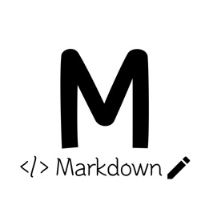

# Инструкция для работы с Markdown

## Выделение текста
Чтобы выделить текст курсивом необходимо обрамить его звездочкой (*) или знаком нижнего подчеркивания (_). Например, *вот так* или _вот так_

Чтобы выделить текст жирным необходимо обрамить его двойной звездочкой (**)  или двойным знаком нижнего подчеркивания (__) Например, **вот так** или __вот так__

Альтернативный способ выделения текста жирным или курсивом нужны для того, чтбы мы могли совмещать оба этих способа. Например, _текст может быть выделен курсивом и при этом быть **полужирным.**_ 

## Списки
Чтобы выделить ненумерованный список, необходимо пункты выделить (*) или знаком +. Например, вот так: 
* Элемент 1
* Элемент 2
* Элемент 3
+ Элемент 4

Чтобы добавить нумерованные списки, необходимо пункты просто пронумеровать. Например, вот так:
1. Пункт 1
2. Пункт 2

## Работа с изображениями

Чтобы вставить изображение в текст, достаточно написать следующее:  
## Ссылки 

Markdown предлагает 3 стиля разметки ссылок: строчный, справочный и автоматический.

* __Строчные__

Для вставки ссылки в строчном стиле необходимо воспользоваться следующей конструкцией: [Текст ссылки]​(URL).\
[GeekBrains](https://geekbrains.ru/)
* __Справочные__

Для вставки ссылки в справочном стиле нужно написать [Текст ссылки]​[Ключ] в том месте, где вы хотите её поместить, а где-нибудь выше или ниже добавить сноску [Ключ]: URL "Подсказка"

Обучаем современным профессия с нуля на сайте [GeekBrains][1]

[1]:https://gb.ru/

* __Автоматические__

Markdown позволяет использовать упрощённый вариант для вставки ссылок, для этого нужно просто обернуть URI треугольными скобками (<URI>).

<https://gb.ru/>

## Работа с таблицами
Необходимо включить пустую строку перед таблицей, чтобы она правильно преобразовалась для просмотра. \
Колонки таблицы размечаются с помощью вертикальных черт (|), а заголовок отделяется дефисами (-).

| Место | Участник | Рейтинг |
|-------|----------|---------|
| 1     | Саша     | 118     |
| 2     | Юля      | 92      |
| 3     | Даниил   | 36      |

Вертикальные черты на обоих концах таблицы не являются обязательными. 
 
Ячейки могут различаться по ширине и не обязательно должны быть идеально выровнены внутри столбцов. В каждом столбце строки заголовка должно быть не менее трех дефисов.

## Цитаты
Если в начале строки поставить треугольную скобку (>), то Markdown превратит текст после неё в цитату. Внутри могут быть любые блоки: параграфы, заголовки или даже другие цитаты.
>Markdown (МФА: [ˈmɑːkdaʊn], произносится маркда́ун) — облегчённый язык разметки, созданный с целью обозначения форматирования в простом тексте, с максимальным сохранением его читаемости человеком

## Заключение 
*__Markdown__* — это облегчённый язык разметки для форматирования текстовых документов. Markdown-файлы без потерь преобразуются в другие форматы (например, HTML и PDF), открываются в любом текстовом редакторе и будут понятны любому человеку даже в виде исходного кода.

*__Git__* — это развитая система контроля версий с активной поддержкой и открытым исходным кодом, которую используют тысячи разработчиков из разных точек мира.

